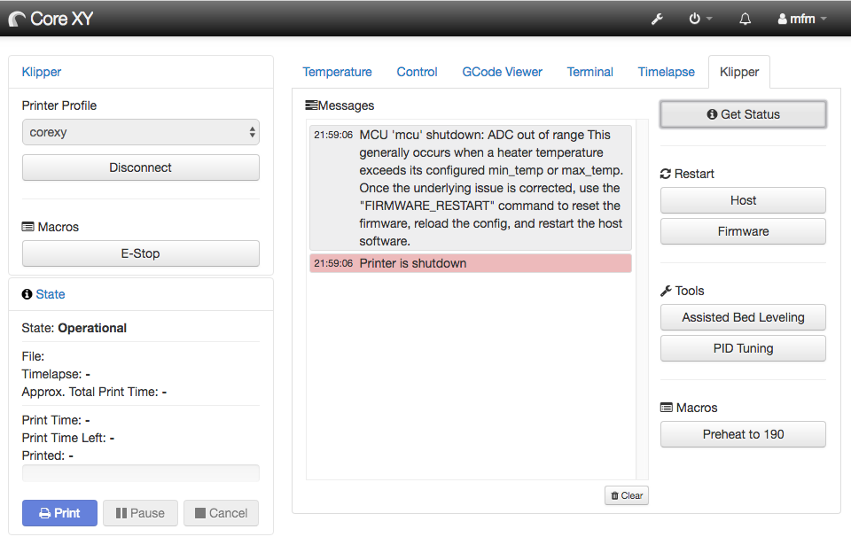
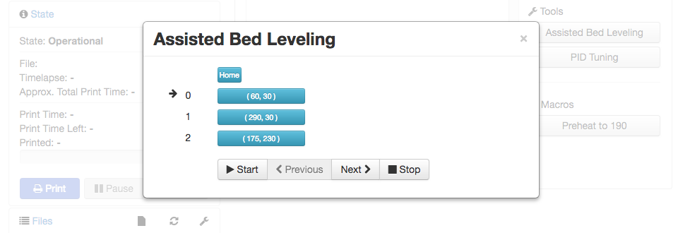
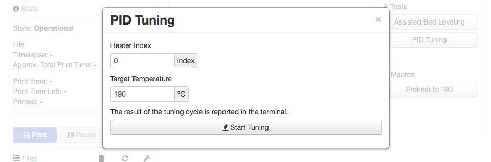
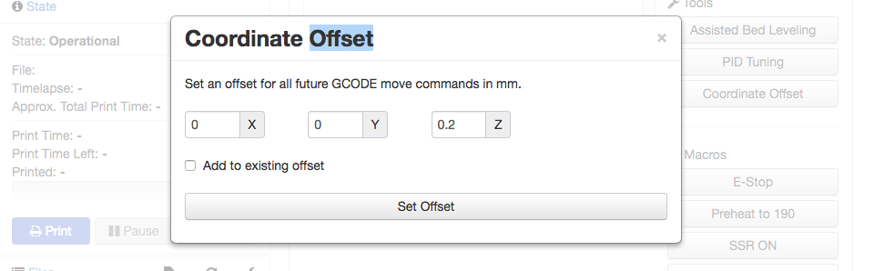
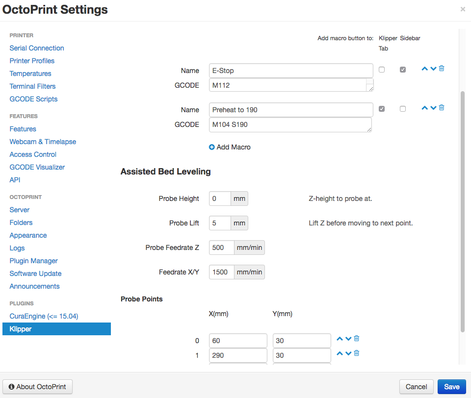
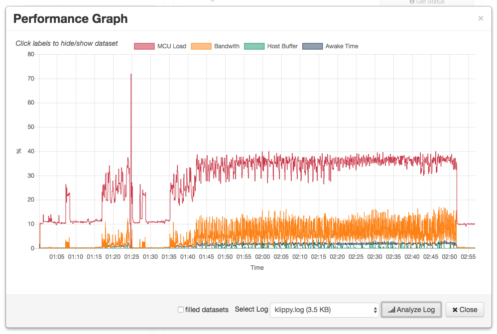

# OctoPrint Klipper Plugin

This plugin assists in managing and monitoring the [Klipper](https://github.com/KevinOConnor/klipper) 3D printer firmware.

### Features
- Simplified connection dialog.
- Restart Host and MCU processes.
- User defineable macro buttons.
- Assisted bed leveling wizard with user definable probe points.
- PID Tuning Dialog.
- Dialog to set a coordinate offset for future GCODE move commands.
- Message log displaying messages from Klipper prepended with "//" and "!!".
- Basic Klipper configuration editor
- Performance graph displaying key parameters extracted from the Klipper logs.

## Installation

Install via OctoPrints [Plugin Manager](http://docs.octoprint.org/en/master/bundledplugins/pluginmanager.html)
or manually using this URL:

    https://github.com/mmone/OctoPrintKlipper/archive/master.zip

## Update

OctoPrint will inform you when a new version of this plugin becomes available.

## Configuration

Click on the wrench icon in the titlebar to open OctoPrints settings dialog. Select "OctoKlipper" at the bottom of the settings dialog.

## Contributions

Also for the moment this plugin does what I wanted it to do, it is far from finished, pull requests are welcome. If you want to get started, the OctoPrint Plugin API is quite well documented here: [docs.octoprint.org/en/master/plugins](http://docs.octoprint.org/en/master/plugins).

## Screenshots

#### Message Log

#### Bed Leveling

#### PID Tuning

#### Coordinate Offset

#### Settings

#### Klipper Config

#### Performance Graph

